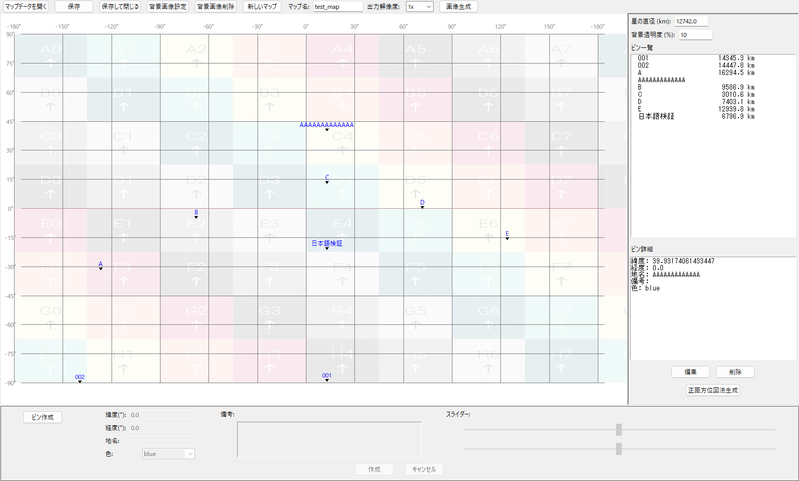

# LocaIndex_Manager

架空の星の土地や地点の位置関係を管理しやすくするためのマップツールです。  
  
マップ情報はPythonコードと同ディレクトリのフォルダに格納されます。  
大圏航路や正距方位図の表示、背景画像の編集が可能です。  
高緯度域を扱うため、地図投影法としてはメルカトル図法ではなく正距円筒図法を採用しています。  

[リリース](https://github.com/mizugane-kou/LocaIndex_Manager/releases/)からDLしたZipを展開してrun.batを実行して使ってください。  
**実行にはPythonが必要です。** Windowsを利用している場合MinecraftストアからDLすることをおすすめします。(簡単です)

  

